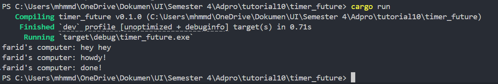

# Module 10 - Timer

### 1.2 Understanding how it works

Pada gambar di atas, terlihat bahwa `farid’s computer: hey hey` dicetak pertama kali, kemudian `farid’s computer: howdy`!, dan setelah dua detik baru muncul `farid’s computer: done!`. Hal tersebut disebabkan karena “.. howdy!” dan “..done!” dibungkus dalam sebuah future yang baru dijalankan ketika executor dijalankan, sedangkan perintah cetak “..hey hey” berada tepat setelah `spawner.spawn(async...)` dan sebelum `executor.run()`, sehingga dieksekusi segera tanpa menunggu future tersebut selesai.