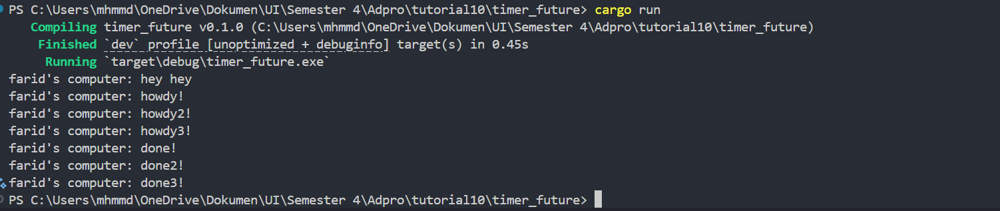
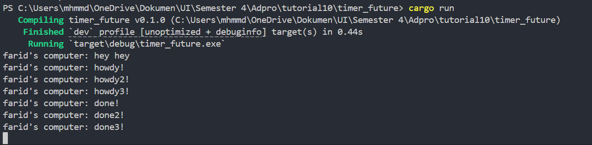

# Module 10 - Timer

### 1.2 Understanding how it works

Pada gambar di atas, terlihat bahwa `farid’s computer: hey hey` dicetak pertama kali, kemudian `farid’s computer: howdy`!, dan setelah dua detik baru muncul `farid’s computer: done!`. Hal tersebut disebabkan karena “.. howdy!” dan “..done!” dibungkus dalam sebuah future yang baru dijalankan ketika executor dijalankan, sedangkan perintah cetak “..hey hey” berada tepat setelah `spawner.spawn(async...)` dan sebelum `executor.run()`, sehingga dieksekusi segera tanpa menunggu future tersebut selesai.

### 1.3: Multiple Spawn and removing drop

Pada gambar pertama, ketiga panggilan spawn menjalankan future hampir bersamaan meski urutan penyelesaian cenderung sesuai urutan pemanggilan. Spawn pertama selesai lebih dulu, kedua berikutnya, ketiga terakhir. Semua future tetap diproses paralel tanpa harus menunggu satu per satu seperti pada pemrograman sinkron. Sementara pesan “hey hey” tetap tercetak lebih dulu karena berada di luar konteks async.

Pada gambar kedua, tanpa memanggil drop(spawner), executor tidak menghentikan eksekusinya meski semua future telah selesai, karena masih menunggu kemungkinan tugas baru dari spawner dengan menambahkan drop(spawner), kita memberi tahu executor bahwa tidak ada lagi tugas yang akan dispawn, sehingga program dapat berhenti setelah menyelesaikan semua future yang ada.